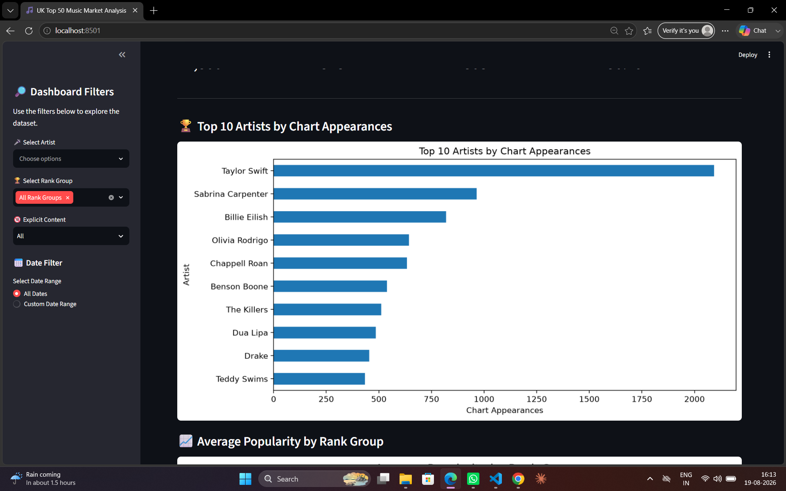
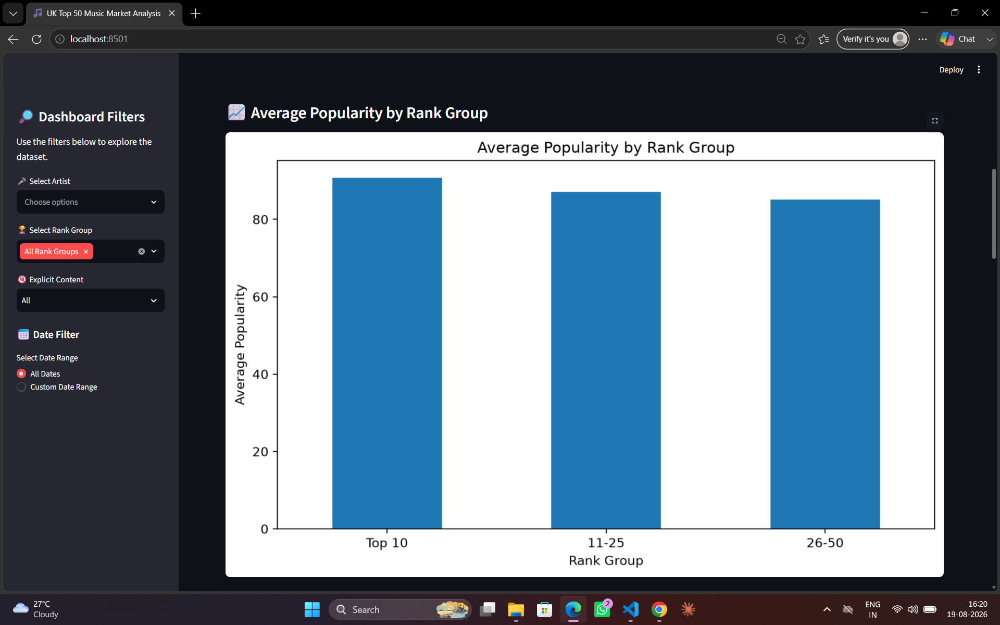
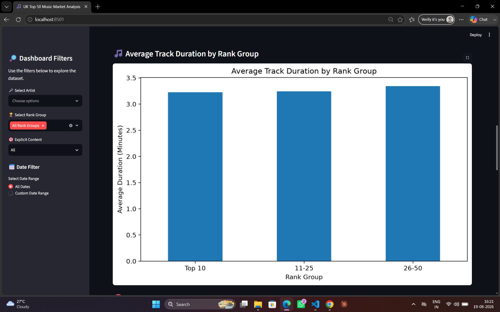
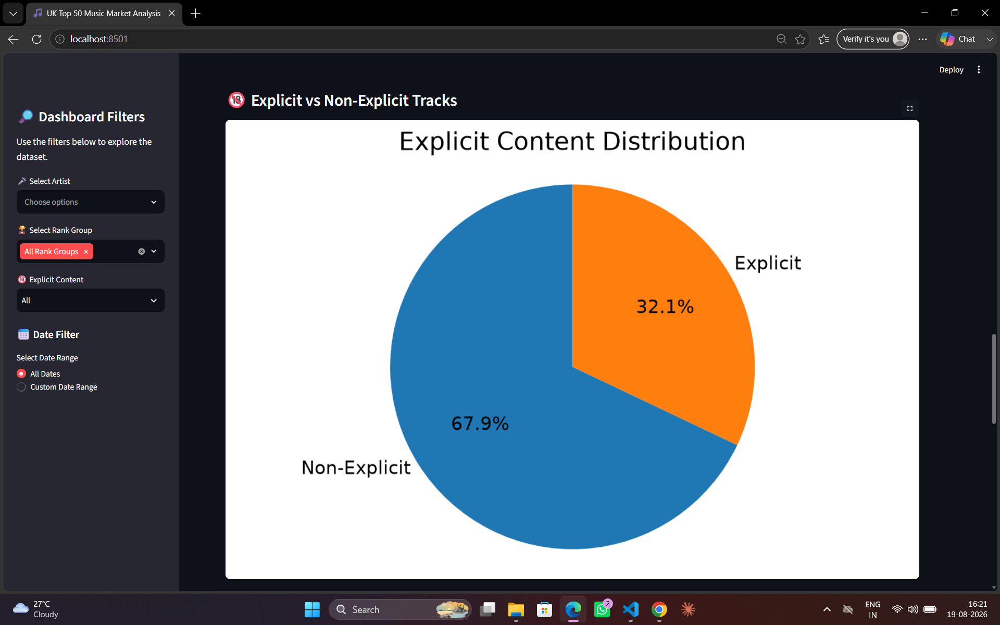
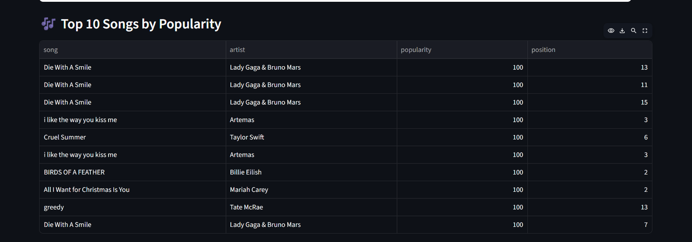
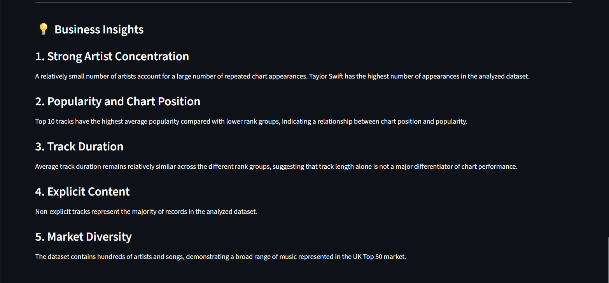
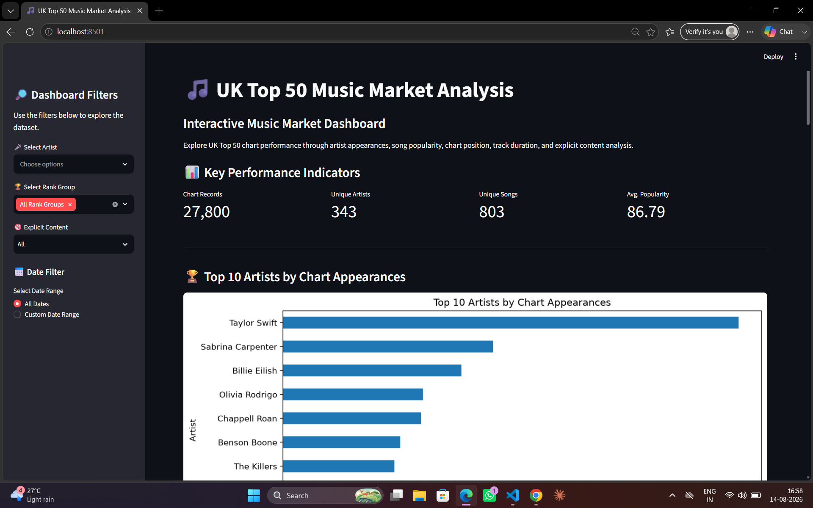
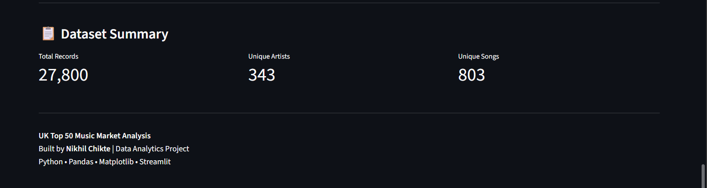

# 🎵 UK Top 50 Music Market Analysis

## 📌 Project Overview

The **UK Top 50 Music Market Analysis** project analyzes music chart data to identify patterns in artist performance, song popularity, chart position, track duration, collaborations, and explicit content.

The project uses **Python, Pandas, Matplotlib, and Streamlit** to transform raw music chart data into meaningful insights and an interactive analytics dashboard.

---

## 🌐 Live Dashboard

Explore the interactive Streamlit dashboard here:

👉 [Open UK Top 50 Music Market Analysis Dashboard](https://uk-top-50-music-market-analysis-ohdnqobw8ume7lhywkchom.streamlit.app/)

---

## 🎯 Project Objectives

The main objectives of this project are to:

- Analyze artist dominance in the UK Top 50 chart.
- Identify the most frequently appearing artists.
- Examine the relationship between chart position and popularity.
- Compare average track duration across different rank groups.
- Analyze explicit and non-explicit track distribution.
- Identify highly popular songs.
- Explore overall diversity within the UK music market.
- Build an interactive dashboard for exploring the dataset.

---

## 📊 Key Performance Indicators

| KPI | Result |
|---|---:|
| Total Chart Records | 27,750 |
| Unique Artists | 343 |
| Unique Songs | 803 |
| Average Popularity | 86.79 |

---

## 🔍 Analysis Performed

### 1. Top Artists by Chart Appearances

Artist appearances were analyzed to identify artists with a strong and repeated presence in the UK Top 50 chart.

Taylor Swift recorded the highest number of chart appearances in the analyzed dataset.



---

### 2. Popularity by Rank Group

Chart positions were divided into three groups:

- **Top 10**
- **Positions 11–25**
- **Positions 26–50**

Tracks in the **Top 10** show the highest average popularity, indicating a relationship between chart position and popularity.



---

### 3. Track Duration Analysis

Average track duration was compared across the different chart rank groups.

Track duration remains relatively similar across the three groups, suggesting that song length alone is not a major differentiator of chart performance.



---

### 4. Explicit Content Analysis

The dataset was analyzed to compare explicit and non-explicit tracks.

- **Non-Explicit:** 67.9%
- **Explicit:** 32.1%

Non-explicit tracks represent the majority of records in the analyzed dataset.



---

### 5. Top Songs by Popularity

Songs were ranked according to their popularity scores to identify highly popular tracks represented in the dataset.



---

## 💡 Business Insights

### 1. Strong Artist Concentration

A relatively small number of artists account for a large number of repeated chart appearances. Taylor Swift has the highest number of appearances in the analyzed dataset.

### 2. Popularity and Chart Position

Top 10 tracks have the highest average popularity compared with lower rank groups, indicating a relationship between chart position and popularity.

### 3. Track Duration

Average track duration remains relatively similar across different rank groups, suggesting that track length alone is not a major differentiator of chart performance.

### 4. Explicit Content

Non-explicit tracks represent the majority of records in the analyzed dataset.

### 5. Market Diversity

The dataset contains hundreds of artists and songs, demonstrating a broad range of music represented in the UK Top 50 market.



---

## 🖥️ Interactive Streamlit Dashboard

An interactive Streamlit dashboard was developed to allow users to explore the UK music market data dynamically.

### Dashboard Features

The dashboard includes:

- 📊 Key Performance Indicators
- 🏆 Top 10 Artists by Chart Appearances
- 📈 Average Popularity by Rank Group
- 🎵 Average Track Duration by Rank Group
- 🔞 Explicit vs Non-Explicit Content Analysis
- 🎶 Top Songs by Popularity
- 💡 Business Insights
- 📋 Dataset Summary

### Dashboard Filters

Users can dynamically filter the dataset by:

- **Artist**
- **Rank Group**
- **Explicit Content**
- **Date Range**

The KPIs, charts, tables, and insights respond to the selected filters.



### 🔗 Live Dashboard

👉 [Launch Interactive Dashboard](https://uk-top-50-music-market-analysis-ohdnqobw8ume7lhywkchom.streamlit.app/)

---

## 🛠️ Technologies Used

- **Python**
- **Pandas**
- **NumPy**
- **Matplotlib**
- **Streamlit**
- **Jupyter Notebook**
- **VS Code**
- **Git**
- **GitHub**

---

## 📁 Project Structure

```text
UK-Top-50-Music-Market-Analysis/
│
├── Dashboard/
│   └── app.py
│
├── Data/
│   ├── Atlantic_United_Kingdom.csv
│   └── Atlantic_United_Kingdom_Cleaned.csv
│
├── Notebook/
│   └── UK_Top_50_Market_Analysis.ipynb
│
├── Screenshots/
│   ├── 01_dashboard_overview.png
│   ├── 02_top_10_artists.png
│   ├── 03_popularity_rank_group.png
│   ├── 04_track_duration.png
│   ├── 05_explicit_content.png
│   ├── 06_top_songs.png
│   ├── 07_business_insights.png
│   └── 08_dataset_summary.png
│
├── Visualizations/
│   ├── album_size_by_rank.png
│   ├── album_type_distribution.png
│   ├── artist_concentration.png
│   ├── collaboration_by_rank.png
│   ├── duration_by_rank.png
│   ├── explicit_by_rank.png
│   ├── explicit_vs_non_explicit.png
│   ├── solo_vs_collaboration.png
│   ├── top_10_artist_dominance.png
│   └── track_duration_distribution.png
│
├── README.md
└── requirements.txt
```

---

## 🚀 How to Run the Dashboard

### 1. Clone the Repository

```bash
git clone https://github.com/nikhilchikte376-hash/UK-Top-50-Music-Market-Analysis.git
```

### 2. Open the Project Directory

```bash
cd UK-Top-50-Music-Market-Analysis
```

### 3. Install Required Libraries

```bash
pip install -r requirements.txt
```

### 4. Run the Streamlit Dashboard

```bash
python -m streamlit run Dashboard/app.py
```

The dashboard will open automatically in your web browser.

---

## 📋 Dataset Summary

The analyzed dataset contains:

- **27,750 chart records**
- **343 unique artists**
- **803 unique songs**
- **86.79 average popularity**

The dataset contains information related to chart positions, songs, artists, popularity, track duration, album characteristics, collaborations, and explicit content.



---

## 📌 Conclusion

The **UK Top 50 Music Market Analysis** demonstrates how music chart data can be transformed into meaningful analytical insights.

The analysis highlights artist dominance, popularity differences across chart positions, track-duration patterns, explicit-content distribution, and overall market diversity.

The interactive Streamlit dashboard provides a practical way to explore these findings dynamically and demonstrates the application of **data cleaning, exploratory data analysis, data visualization, business insight generation, and dashboard development** using Python.

---

## 👤 Author

**Nikhil Chikte**

Data Analytics Project

**Tools:** Python • Pandas • Matplotlib • Streamlit

### 🔗 Project Links

- **GitHub Repository:** [UK Top 50 Music Market Analysis](https://github.com/nikhilchikte376-hash/UK-Top-50-Music-Market-Analysis)
- **Live Dashboard:** [Streamlit Dashboard](https://uk-top-50-music-market-analysis-ohdnqobw8ume7lhywkchom.streamlit.app/)

---

⭐ **If you found this project useful, consider giving the repository a star!**
