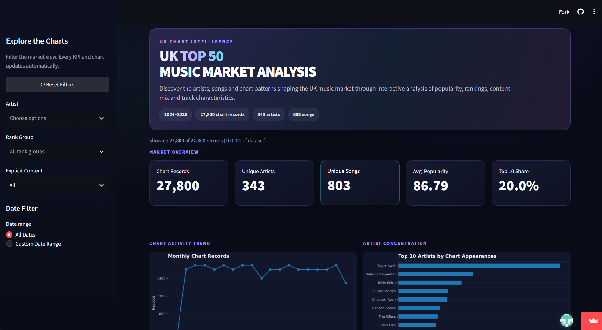
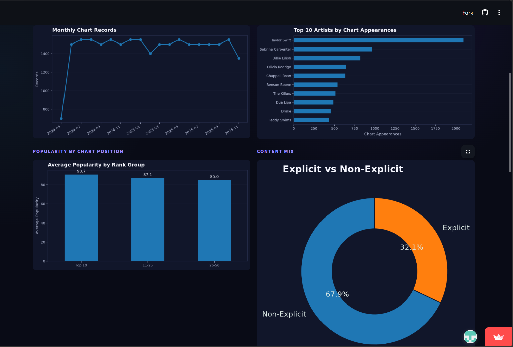
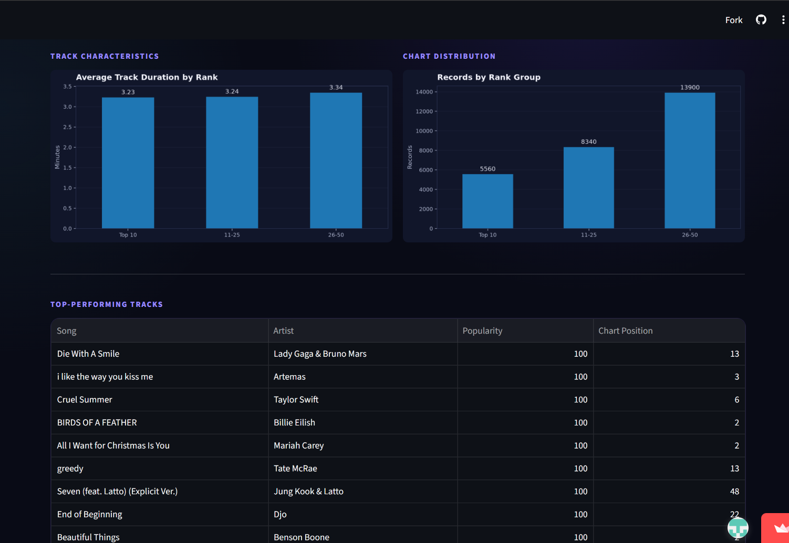
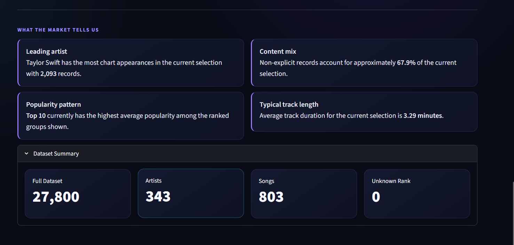

# 🎵 UK Top 50 Music Market Analysis

## 📌 Project Overview

The **UK Top 50 Music Market Analysis** is an interactive data analytics project designed to explore patterns and trends within the UK music charts.

The project analyzes **27,800 chart records** to understand artist performance, song popularity, chart rankings, track duration, explicit-content distribution, and overall market diversity.

Using **Python, Pandas, NumPy, Matplotlib, and Streamlit**, the project transforms raw music chart data into meaningful insights through exploratory data analysis and an interactive market intelligence dashboard.

---

## 🌐 Live Dashboard

Explore the interactive dashboard:

👉 [Open UK Top 50 Music Market Analysis Dashboard](https://uk-top-50-music-market-analysis-ohdnqobw8ume7lhywkchom.streamlit.app/)

---

## 🎯 Project Objectives

The main objectives of this project are to:

- Analyze artist dominance in the UK Top 50 chart.
- Identify artists with the highest number of chart appearances.
- Examine the relationship between chart position and popularity.
- Analyze chart activity over time.
- Compare average track duration across different rank groups.
- Analyze explicit and non-explicit content distribution.
- Identify highly popular songs.
- Explore diversity within the UK music market.
- Build an interactive dashboard for dynamic data exploration.

---

## 📊 Key Performance Indicators

| KPI | Result |
|---|---:|
| Total Chart Records | 27,800 |
| Unique Artists | 343 |
| Unique Songs | 803 |
| Average Popularity | 86.79 |
| Top 10 Share | 20.0% |

---

## 🔍 Analysis Performed

### 1. Monthly Chart Activity

Chart records were analyzed over time to understand how chart activity changes across the available date range.

The dashboard provides a monthly trend view that dynamically responds to the selected filters.

### 2. Top Artists by Chart Appearances

Artist appearances were analyzed to identify performers with a strong and repeated presence in the UK Top 50 chart.

**Taylor Swift** recorded the highest number of chart appearances in the analyzed dataset.

### 3. Popularity by Rank Group

Chart positions were divided into three major groups:

- **Top 10**
- **Positions 11–25**
- **Positions 26–50**

Tracks in the **Top 10** show the highest average popularity, indicating a relationship between chart position and popularity within the analyzed dataset.

### 4. Track Duration Analysis

Average track duration was compared across different chart rank groups.

Track duration remains relatively similar across the groups, suggesting that song length alone is not a major differentiator of chart performance in this dataset.

### 5. Explicit Content Analysis

The dataset was analyzed to compare explicit and non-explicit tracks.

- **Non-Explicit:** 67.9%
- **Explicit:** 32.1%

Non-explicit tracks represent the majority of records in the analyzed dataset.

### 6. Top Songs by Popularity

Songs were analyzed according to their popularity scores to identify highly popular tracks represented in the dataset.

---

## 💡 Key Market Insights

### 🏆 Strong Artist Concentration

A relatively small group of artists accounts for a large number of repeated chart appearances. **Taylor Swift** has the highest number of appearances in the analyzed dataset.

### 🎯 Popularity and Chart Position

Top 10 tracks have the highest average popularity compared with lower rank groups, showing a relationship between chart position and popularity.

### ⏱️ Track Duration

Average track duration remains relatively similar across different rank groups, suggesting that track length alone does not strongly differentiate chart performance.

### 🎵 Content Mix

Non-explicit tracks represent the majority of chart records in the analyzed dataset.

### 📊 Market Diversity

The dataset contains **343 unique artists** and **803 unique songs**, representing a broad range of music within the analyzed UK Top 50 market.

---

## 🖥️ Interactive Streamlit Dashboard

A premium interactive Streamlit dashboard was developed to allow users to explore the UK music market dynamically.

The dashboard combines KPIs, trends, rankings, content analysis, and dynamically generated insights in a single interactive interface.

### Dashboard Features

- 📊 Dynamic KPI Cards
- 📈 Monthly Chart Records Trend
- 🏆 Top 10 Artists by Chart Appearances
- 🎯 Average Popularity by Rank Group
- 🔞 Explicit vs Non-Explicit Content Analysis
- ⏱️ Average Track Duration by Rank Group
- 📊 Rank Distribution Analysis
- 🎶 Top Songs by Popularity
- 💡 Dynamic Market Insights
- 📋 Dataset Summary
- 🔄 Reset Filters Functionality

### Interactive Filters

Users can dynamically filter the dashboard by:

- **Artist**
- **Rank Group**
- **Explicit Content**
- **Date Range**

The KPIs, charts, tables, and insights automatically respond to the selected filters.

### 🔗 Launch Dashboard

👉 [Launch Interactive Streamlit Dashboard](https://uk-top-50-music-market-analysis-ohdnqobw8ume7lhywkchom.streamlit.app/)

---

## 📸 Dashboard Screenshots

### 1. Dashboard Overview

Premium dashboard overview showing interactive filters, dataset information, and key performance indicators.



### 2. Market Analysis

Monthly chart activity, leading artists, popularity across rank groups, and explicit vs non-explicit content distribution.



### 3. Track & Song Analysis

Track-duration patterns, chart-rank distribution, and top-performing songs by popularity.



### 4. Business Insights

Dynamic market insights highlighting the leading artist, content mix, popularity patterns, typical track length, and dataset summary.



---

## 🛠️ Technologies Used

- **Python**
- **Pandas**
- **NumPy**
- **Matplotlib**
- **Streamlit**
- **Jupyter Notebook**
- **VS Code**
- **Git**
- **GitHub**

---

## 📁 Project Structure

```text
UK-Top-50-Music-Market-Analysis/
│
├── Dashboard/
│   └── app.py
│
├── Data/
│   ├── Atlantic_United_Kingdom.csv
│   └── Atlantic_United_Kingdom_Cleaned.csv
│
├── Notebook/
│   └── UK_Top_50_Market_Analysis.ipynb
│
├── Reports/
│   └── UK_Top_50_Music_Market_Analysis_Report.pdf
│
├── Screenshots/
│   ├── 01_dashboard_overview.png
│   ├── 02_market_analysis.png
│   ├── 03_track_and_song_analysis.png
│   └── 04_business_insights.png
│
├── Visualizations/
│   ├── album_size_by_rank.png
│   ├── album_type_distribution.png
│   ├── artist_concentration.png
│   ├── collaboration_by_rank.png
│   ├── duration_by_rank.png
│   ├── explicit_by_rank.png
│   ├── explicit_vs_non_explicit.png
│   ├── solo_vs_collaboration.png
│   ├── top_10_artist_dominance.png
│   └── track_duration_distribution.png
│
├── README.md
└── requirements.txt
```

---

## 📄 Project Report

A detailed project report containing the analysis methodology, findings, visualizations, business insights, dashboard development, and conclusions is available in the repository.

📁 `Reports/UK_Top_50_Music_Market_Analysis_Report.pdf`

---

## 🚀 How to Run the Dashboard

### 1. Clone the Repository

```bash
git clone https://github.com/nikhilchikte376-hash/UK-Top-50-Music-Market-Analysis.git
```

### 2. Open the Project Directory

```bash
cd UK-Top-50-Music-Market-Analysis
```

### 3. Install Required Libraries

```bash
pip install -r requirements.txt
```

### 4. Run the Streamlit Dashboard

```bash
python -m streamlit run Dashboard/app.py
```

The dashboard will open in your web browser.

---

## 📋 Dataset Summary

The analyzed dataset contains:

- **27,800 chart records**
- **343 unique artists**
- **803 unique songs**
- **86.79 average popularity**
- **20.0% Top 10 share**

The dataset includes information related to chart positions, songs, artists, popularity, track duration, album characteristics, collaborations, and explicit content.

---

## 📌 Conclusion

The **UK Top 50 Music Market Analysis** demonstrates how music chart data can be transformed into meaningful analytical insights and an interactive data product.

The analysis highlights artist concentration, popularity differences across chart positions, track-duration patterns, explicit-content distribution, chart activity, and overall market diversity.

The interactive Streamlit dashboard provides a practical way to explore these findings dynamically while demonstrating skills in **data cleaning, exploratory data analysis, data visualization, insight generation, interactive filtering, dashboard development, version control, and cloud deployment**.

---

## 👤 Author

**Nikhil Chikte**

Data Analytics Project

**Tools:** Python • Pandas • NumPy • Matplotlib • Streamlit

### 🔗 Project Links

- **GitHub Repository:** [UK Top 50 Music Market Analysis](https://github.com/nikhilchikte376-hash/UK-Top-50-Music-Market-Analysis)
- **Live Dashboard:** [Streamlit Dashboard](https://uk-top-50-music-market-analysis-ohdnqobw8ume7lhywkchom.streamlit.app/)

---

⭐ **If you found this project useful, consider giving the repository a star!**